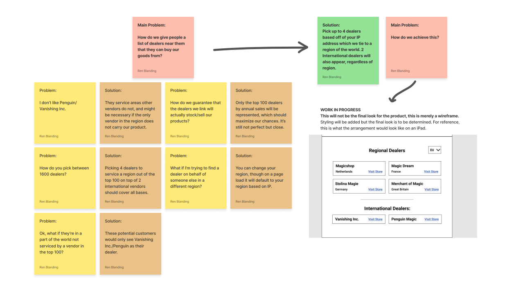

### In Depth

One of the biggest issues faced at Murphy’s Magic was the disconnect between their products and their end consumers. While the company made a lot of end-consumer facing products, there was a long-standing promise to all of our dealers that we wouldn’t sell direct. Users would go to our product page, but could not purchase any of our items. With the goal of increasing sales and pushing customers into a sales funnel, we began to work on a system within our website that would break down some of our barriers to a sale.

#### BEFORE (Product Analysis)

Before I joined Murphy’s Magic, there were two main methods that were used to push consumers to purchase items we were promoting. One was reserved primarily for special items promoted on what we called our “Black Label” items, where our custom made landing pages for products would have a curated list of dealers around the world that consumers could purchase from. 

While very simple, this method had a few major drawbacks. The most apparent issue with this method of advertisement was the manual aspect of the site’s setup. Hand picking 8 magic dealers around the world meant that we could cover a lot of ground, but not all of the sites would be particularly useful for our global audience. It was very likely that only one of those options would be viable for a customer, and some customers in regions such as Africa would be unable to find a dealer entirely. To top that off, we serviced over 1500 dealers, making the choice controversial among dealer customers who felt as though we picked favorites.

The second method we used to push for consumer sales was social media. Social media was incredible for reaching our intended audience, regardless of what platform we used. Being able to demonstrate the product in various formats and campaigns also made for a compelling buy for our customers, but there were still a lot of limits within social media that made it hard to use as well. Just like our landing pages, the dealers were picked manually for social media. Even worse than our landing pages though, different platforms might only allow a single link, blocking off a significant portion of our audience outside of the United States.

#### SOLUTION
My initial thoughts when designing the solution for this “Find a dealer” tool were the most obvious route: Google’s Maps Platform. Given how robust and universal the API is on the internet, it felt like a perfect fit for our new utility. There were a few issues with it that made the platform hard to use for our case, however. The first one was that maps don’t always make sense from a user perspective and make it difficult for users to tell what dealers they might want in their area. Because Maps usually prioritizes your proximity to the nearest location, customers might get recommended to a dealer's brick and mortar location when they actually prefer shipments from somewhere further away. Because Maps also uses pinpoints on maps to show the number of locations, one would have to adjust it quite heavily to ensure that users could see text information at a glance.

By far, the biggest issue we had was cost. Due to the volume of our traffic for these products, we would have far too many API calls to make up for the sales from end consumers. Thankfully, the IT department had another API in mind that would allow us to use IP addresses from users to help them pinpoint locations near them. Since that solution was a lot simpler to implement, our proposal used that to recommend an automated list of dealers from the top 100 dealers by sales. This number was used to ensure the maximum compatibility between the dealers across the world, while ensuring that customers were getting more reliable dealers to service them if they wanted to buy a product. For users who could not be serviced in a region because they lacked a top 100 dealer, we offered links to Vanishing Inc. and Penguin Magic, who both offered free worldwide shipping. Just in case people wanted to recommend dealers to friends/family/etc outside of their region, there was a drop down menu that allowed them to change what region they were trying to find dealers for. The following was summed up in this Figjam chart:

With the results from our planning, a prototype was generated in Figma, which looks like the screen below. While this hasn't been successfully implemented yet at Murphy's Magic, it should be appearing in the future!

#### LIMITATIONS
The biggest limitations in our “Find a Dealer” option was a big one: connectivity. We can link to other dealers, but because there’s no uniformity in the industry’s dealer e-commerce platforms, we have no way of accurately linking to product pages for the product itself. We could only link to the home page of our dealers, making the dealer finder feature incredibly limiting and not fixing the issue of our sales funnel not working. With this limitation in mind --- Why bother to do all of this? “Find a dealer” would be solved most efficiently if we were willing to sell directly to consumers, but since we’re not, the solutions end up being more convoluted than they need to be for us to take any action at all. While the resulting research and planning led to results that we had set out to achieve, it’s worth considering whether the better thing was to let sleeping dogs lie on this project.
