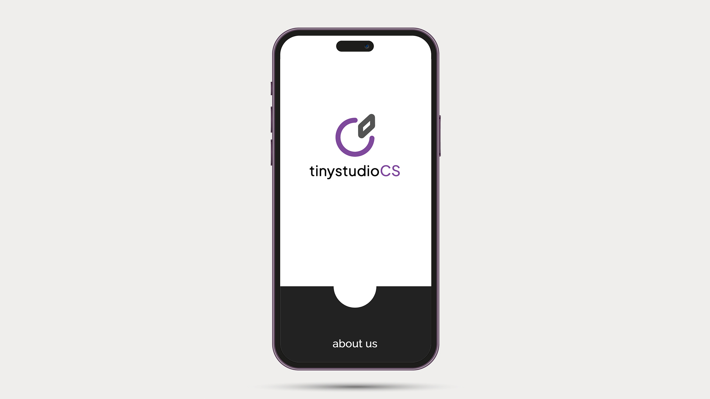
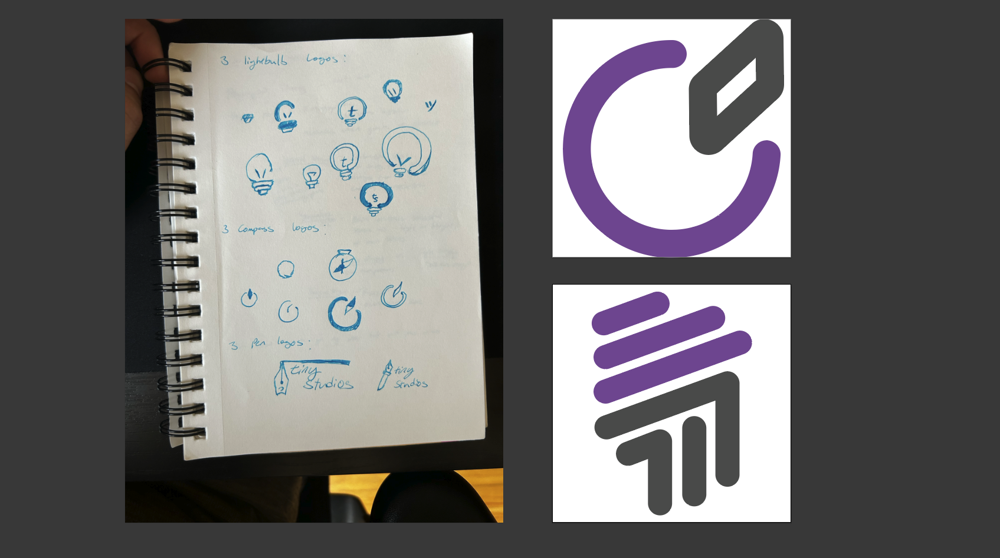
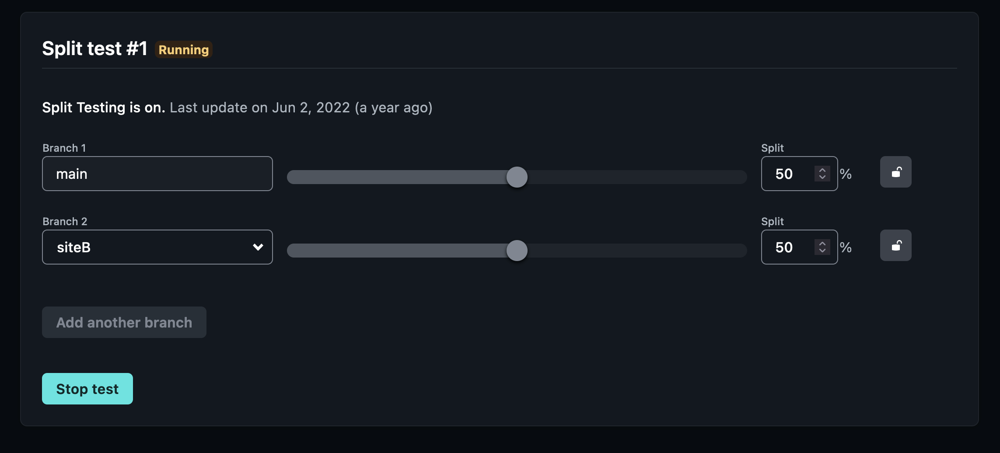
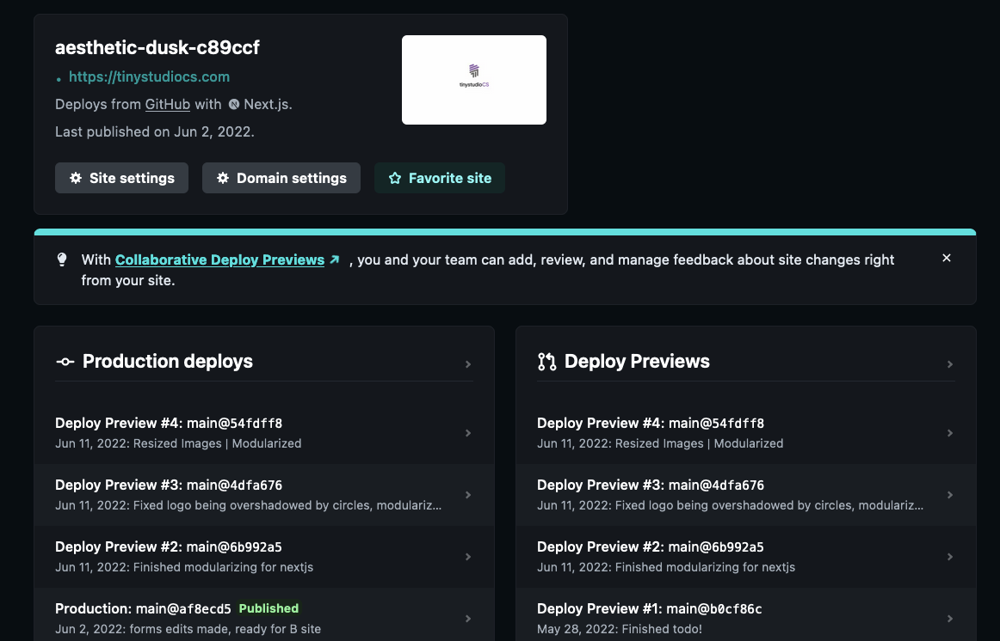

### Website Link:
[https://tinystudiocs.com/](https://tinystudiocs.com/)

In the summer of 2022, I had a friend reach out to me with the intent to start a web design business. He had a some dentistry clients he wanted to customize websites for and we got to work making a side-gig out of it. But of course, we needed a brand and identity to do that under so we got started on that first! The project eventually got sidelined as I got hired at Adage Technologies and my project partner started medical school but we did manage to create a basic branding and create a sample site.

For the branding, we met a few times to sketch out sample logos using my friend's preferred brand identity information. We discussed use of colors, forms, and sketching concepts. After that, we created multiple logo ideas from 3 different concepts and settled for the final two that you can see in the link above. We loved both logo ideas but were unsure of which concept clients would prefer, so I set up branches in GitHub to build an A/B test through Netlify. Users would have a 50% chance of getting either logo iteration and we hoped to track the length of engagement as a metric to determine a winning design.

#### Dev Structure

The scope of the project was small, but the simplicity was the point. I had minimal experience with web development but I wanted to try out some HTML/CSS as well as uploading a live site to the web besides my portfolio which was mostly preconfigured. I built the wireframe in Figma and we executed on the site design. Together, we worked on the CSS and pair programmed on some of the issues I was having with the implementation. I performed a few PRs on the code that my partner used to fix CSS issues I had and learned how to create branches with the intent of trying an AB test through Netlify. As well as that, we implemented a forms feature with Netlify that linked to a business email.

As for uploading the site to the web, Netlify makes uploading sites really simple. Afterwards, all that was required was to purchase a domain name via Porkbun and providing Netlify with sufficient information to connect the repo to the domain name. And that's all to it!

