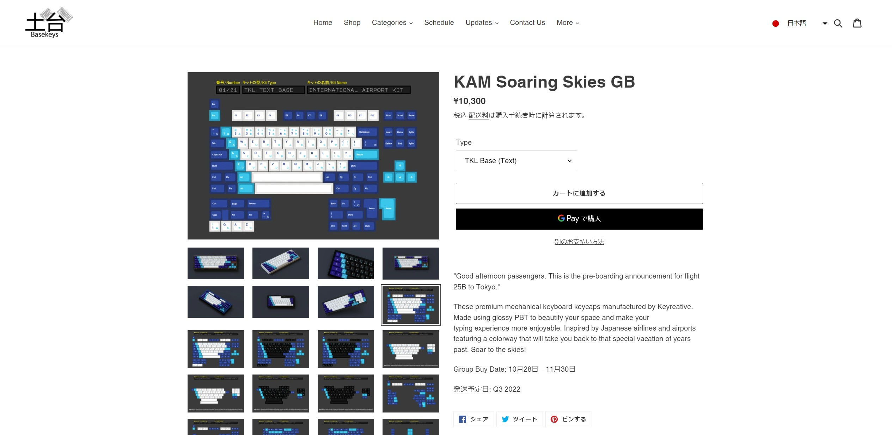

#### Project Links
- [Vendor Link - Vala Supply (USA)](https://vala.supply/collections/ended-group-buys/products/kam-soaring-skies)
- [Vendor Link - zFrontier (Intl/China)](https://en.zfrontier.com/products/in-stock-kam-soaring-skies)
- [Imgur Gallery of Customer Examples](https://imgur.com/a/c52mnXK)

### In Depth

I'd always wanted to make a design for one of my favorite hobbies: the custom mechanical keyboard community. Through lots of drafts and revisions, I began to develop a aviation-inspired design concept which would take over 2 years to see to completion. The keyboard caps had all of the characters/symbols/novelty keys aligned by hand, and were manufactured with a glossy coat to make the colors and feel stand out from the most common options sold within the mechanical keyboards hobby.

With KAM being a niche hobbyist keycap style of product, it was really important to market this set towards the niches of the hobby who would most actively support the set. Lots of hobbyists within the space have DIY and non-standard keyboards that often cannot get keyboard kits to accomodate them, and their extremely active online community was a great target audience to tailor this design for. With that in mind, I spent the majority of the design phase of this project ensuring that the keyboard design fit the specifications of this community (often referred to as the 40% community denoting the smaller size of their boards). This was incredibly tedious and would require lots of validation and community input, but paid off in the end with the majority of kits sold in the US being by 40% keyboard users. But as for that validation...

The community's feedback was also critical in this project, and I employed 2 rounds of user surveys to get feedback on the configuration of the product and ensure that my project was kitted for as many users as possible. When creating the Interest Check, my user survey had a few goals:

#### User Survey Goals:
 - Are all of the keycap kits properly kitted for users? Are my Japanese keycap kits properly fitted for Japanese hobbyists?
 - What artisans would the community like for me to collaborate with?
 - Gain insight from the community to see what design suggestions they have.
 - Gauge popularity for my project, and the odds of success if it went to group buy.

#### User Survey Questions:
1. Where did you find this post? (Social Media Platform)
2. Which keycap kits would you be interested in buying?
3. Are there any collaborations you would like to see for KAM Soaring Skies?
4. What suggestions do you have for the kit? Any changes you would like to see? (Ex: Different sublegends, changes to kitting)
5. Anything else?

[To see the survey in detail, click this link:](https://forms.gle/wfsJqZvXeWRQCYvx6)

#### Findings:
- While not many users showed initial interest, those who did expressed great support. I received 66 responses, though more popular sets tend to get around 100+.
- My product's kitting layout had a lot of initial errors, and required additional changes to ensure maximum compatibility with customer keyboards.
- Users wanted more options for keyboard kits. This sparked a change from 13 to 21 total kits available for purchase.
- The suggestion from the community to make this keycap set implement glossy keycaps ended up being the strongest selling point for the keycaps when they went on sale. This change alone was one of the largest contributors to the success in selling my keycap set.
- With survey bias, it would be important to not take the findings here as a true representative of the industry's thoughts on my work.

When I started, I didn't know how to render my keyboard project in 3D, which is a necessity in the hobby. Commissioning a 3D artist was not in my budget at the time, so I resolved to learn the process from start to finish in the span of a week. The renders were possible thanks to a community tool for Blender. [All renders can be seen here](https://imgur.com/a/TjAP57r) and the picture below was a render used to advertise the product.

After reaching out to various vendors in the community, I had found a vendor in Vala Supply. They are an Oregon-based keyboard retailer that was more than happy to help make my set a reality, but we needed global reach to get this sale done. I got in touch with 7 different vendors from around the world, as well as the intended manufacturer of KAM Soaring Skies: Keyreative. Through their help, we were able to organize the sale and get it running. The group buy ended in November of 2021 and reached ~$70,000 in sales in one month, with an arrival time of April 2023 for end consumers who purchased the set! [For the KAM Soaring Skies store page, click here.](https://vala.supply/products/kam-soaring-skies)

> Store page for Basekeys, the Japanese vendor that sold KAM Soaring Skies
