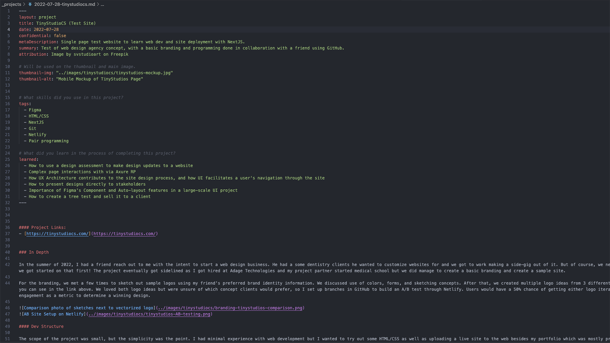

#### Project Links
- [Current Netlify Site link](https://chipper-cranachan-7c0631.netlify.app/)
- [GitHub Repo for Portfolio](https://github.com/Hakata-jpn/portfolio)

### In Depth

Since 2021 I've been using the Fernfolio web template as my portfolio site, and it's served me really well in that timeframe. It helped me learn Markdown, version control with Git, and practice CSS while having a mobile-friendly site. It fit the bill between flexibility of design options while being accessible enough from a designer standpoint to define my personal brand and not be gridlocked by the site structure.

While it allowed me to focus more on the portfolio content itself, over the years I began to feel like I was outgrowing the template as my skills improved and the site did not. Some aspects of the page were thoughtfully designed but not necessarily built from the ground up to facilitate the showcasing of my previous works. Rating the site layout, here are my thoughts: 

> This is an example of the previous template site I used.

#### What I liked:
1. Easy access to projects from the home page
2. Portfolio projects are easily labeled depending on desired reading depth
3. Markdown for quick site edits

#### What I didn't like:
1. The colors of the site were dark and not approachable
2. Site does not give visual examples of my best works
3. Reliance on site template whose technologies I did not understand (Nunjucks)

#### Design
With all of these factors in consideration, a new design was in order with the goal of a friendlier and more visually expressive UI to highlight my recent experiences. Emphasis was placed on the use of Figma's Auto Layout and Component tools as those were ones I'd recently learned, and using those to create an aesthetic layout that used visual elements that stood out more. Of note, the color scheme was a point of emphasis due to my previous use of "comfort colors" and a desire to break out a little more from what I would most frequently consider. The general structure was updated, and the article structure is the key feature being migrated from the previous iteration of the site.

#### Development

The site was developed using a mix of Jekyll and Bootstrap, with additional styling and interactions using a combination of Sass and vanilla Javascript. The process took approximately three weeks and was a considerable challenge for me as someone who had some experience with web development but never made a full-service website at this scale. Some aspects of the Figma design made the development process incredibly simple, such as the use of style variables that were easily transferred to Sass variables and limiting spacing on the design to revolve around the base pixel size of 16. Auto Layout was immensely helpful in being able to recreate designs within the box model, and truly leveled up my understanding of flexbox with how easy it made understanding the layout of nested divs. 

One interesting consideration that became a difficult constraint throughout the project was the difference between breakpoints in Figma and in Web development. While Auto-layout does make working within moving breakpoints a lot easier, it also took a lot more effort to ensure a consistent design across multiple screen sizes and browsers. One side effect of this was a design pattern that was unable to translate across devices, a div sandwiched between and on top of two divs in the HTML, as spacing the text blurb between the two colored areas was not something I could make consistent across all screen sizes.

> This might have taken three hours of my time and numerous tries, but I learned a lot about document flow and positioning so it was well worth it.

Being a static site generator, Jekyll made the process of creating the portfolio contents rather simple and allowed for component creation in a manner similar to but simpler than React. Structurally, all of my project articles are written in markdown and placed in a designated project folder which is built into HTML pages when I commit my changes to GitHub and Netlify builds the site. It also allowed a smooth transfer of my old markdown files from my old portfolio site to this one, with some adjustments made to the front matter to improve the templating of the site. This allowed for some modularity in the project article, including:
- Thumbnail images with alt text
- Toggles for image attribution
- Toggles for projects with limited info due to confidentiality
- Project tags
- A "What I learned" section built into the page structure

And the document looks like the image below, with the body content of the page outside of the front matter for easy writing.

The front matter was incredibly helpful for calling data across the site, as every part of the site could access any of the articles I'd written in a procedural manner. This allows me the ease of mind to simply write new content in Markdown and commit it to the site without worrying about having to adjust the code to highlight new content. While this did exist in my previous site, the biggest difference was that I knew the structure because I had built it myself and could change the design if desired.

The biggest challenge of the project was a lesson learned with bootstrap. While my time with Bootstrap was simplified by designing the wireframes into the 12 column structure it uses, I learned the hard way about how opinionated the styling can be. I had to use `!important` a few times to overwrite bootstrap styles (which is not great), and while I used their initial navbar HTML template for the site, some issues with the implementation forced me to decouple the navbar from bootstrap and recreate it in Vanilla JS. Because my site is mostly a single page app, my nav links were anchor tags, which would cause the mobile bootstrap nav to navigate to the anchor but not collapse the hamburger menu and be in the way of the user's view of my page. While it was a bug you could fix very easily by closing the header, users should not be forced to take extra steps to access such a simple site. I spent hours on this bug with a friend trying to help me use asynchronous functions to make the header work with the existing bootstrap JS scripts. Eventually, we realized that it wasn't going to work very well and I developed a js script to fix the bug. Using vanilla JS, it was very simple to add an event listener to the nav links and get the hamburger menu to collapse if clicked on with a mobile device. It also made it really easy to add a tablet breakpoint so users would not have a disappearing nav on larger screens. I had a lot of fun trying to fix this with vanilla JS as it taught me more about how JS and the DOM work which was really hard to grasp for the longest time.