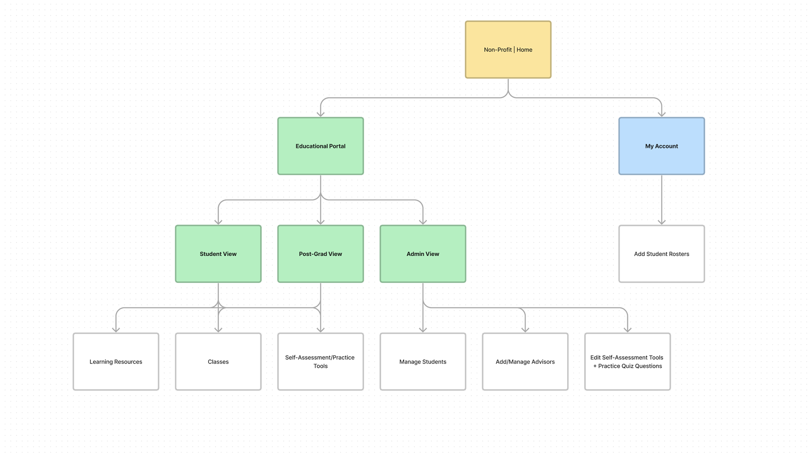
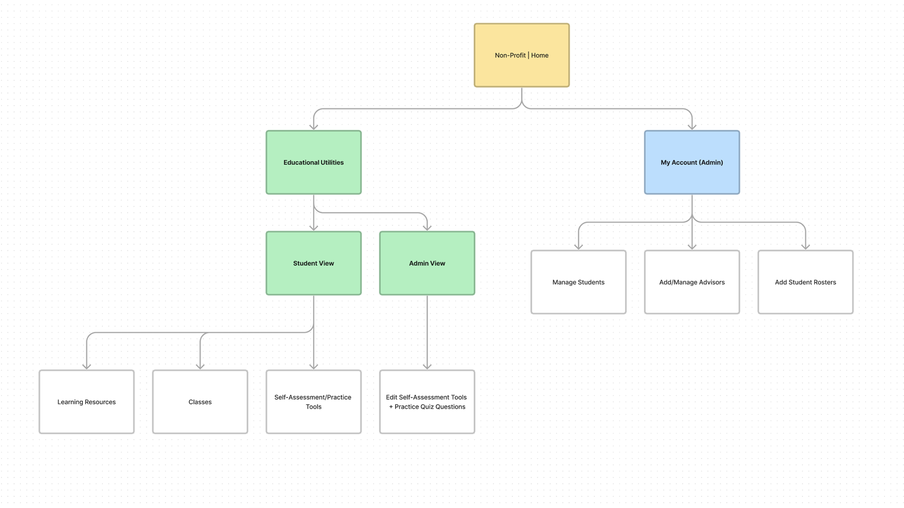

### In Depth

One of the first projects I did when working for my agency was under a large educational client who handled varying types of certification and accreditation for college students as well as post-grad programs. Their platform had dated back to the 00's, and the site's architecture was in need of an update as the most current iteration was focused on a legacy desktop experience with no scaling or design consideration for mobile screens and modern technologies. As well, the methods of use on the site were beginning to show their age and frustrations had long been made internally by the client org as well as by learners.

#### Sample UX Architecture

Internally, the structure of the site was mapped to look like the image below. While not leading this initiative, I mapped out the current site's educational architecture and assisted with the redesign of the site's UX Architecture.

With a migration of the educational portal within the main organization's website, features from the old education platform had to be reevaluated and migrated properly. Alongside that, the new educational portal was designated to be integrated into the main site experience since it was already partially so and inconvenient for administrators to manage the educational experience from two different areas of the site. Features were shuffled around as follows. 

#### Internal Wireframes

With the architecture laid out and revised for the next stage of platform migration, I was tasked with updating the roster management pages of the educational suite to incorporate a mobile-based design as well as improve the usability of its current features. One of the biggest changes that had to be made was the shift from the old modal-based design to a card based design that gave key student information to administrators at a glance and allowed for easy clickability for mobile users. This clickability was then prototyped using Axure RP's prototyping tools, which marked the first time I worked on Axure. The program was significantly more complex with its interactability but with that came the power to more closely resemble real-world interactions which was a huge boon for demoing to both devs and clients.

> NOTE: These wireframes are a representation of the final client wireframes.

Care had to be taken to make sure that the increase in component size did not significantly bloat the UI but a balance was struck in the final wireframe implementation. With the possibility of hundreds of students per roster, every addition to vertical height had the risk of adding strain to an Administrator's efficient use of the software. To ensure feasibility of design, developers from the client end and our internal teams were called upon for regular demoing and feedback. This allowed us to ensure that designs were ready for hand-off almost immediately.