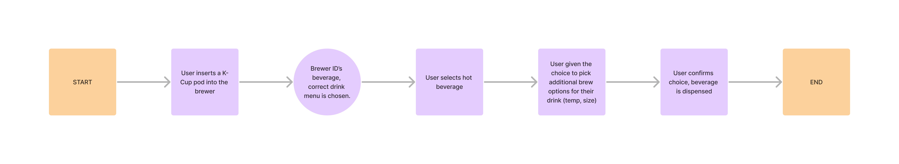

### In Depth
 
At the beginning of 2024, Keurig's commercial team launched updates to several commercial brewers that included the K4500. Previously, users were not able to brew iced beverages unless they chose a specific product designed to be poured over ice. With [75% of Starbucks' Q3 2022 sales being generated by iced drinks](https://archive.ph/0Yo0L), giving users an option to create cold beverages would allow Keurig to more fully tap into the beverage market. In order to do so, the UI needed retooling to make users aware of this new capability and do so in a way that kept the experience as seamless as possible. Here's the result:

<iframe width="560" height="315" src="https://www.youtube.com/embed/fBQrAHp1org?si=KYqa_tCkxe66X734" title="YouTube video player" frameborder="0" allow="accelerometer; autoplay; clipboard-write; encrypted-media; gyroscope; picture-in-picture; web-share" referrerpolicy="strict-origin-when-cross-origin" allowfullscreen></iframe>

In order to get here, there were a few steps we needed to take:

1. Update the user flow
2. Reproduce high-fidelity wireframes of various versions of the user flow
3. Test all versions of the updated user flows
4. Launch!*

> *There were a few  design refinements that were also made before launch, more on that later.

#### User Flows

One of the key constraints of the K4500 is that the user flow was intentionally designed to be minimal. Previous research indicated that consumers of Keurig beverages want their beverages fast, and are quickly frustrated by inconveniences in between them and the beverage (I'm sure you or someone you know loves Keurig for that exact reason!). With this product being a full-service machine for offices and other commercial use, compromises needed to be made to expand the menu to nearly double the size without frustrating consumers. In addition, we were introducing a new beverage feature that many users would not think the Keurig was capable of, given our decades of serving almost exclusively hot beverages. With these factors in mind, the old user flow looks something like this:

So the obvious solution was to introduce a menu screen at the start of the user flow, but that still left some questions unanswered. We weren't sure if users wanted to switch from a hot or cold drink at any time while they were selecting their beverage, and thus we wanted to test various options throughout the user flow that would allow users to perform error handling. This brought about various versions of the user flow that allowed users to change their beverage from hot to cold, all of which were designed in Figma and tested with UserTesting. The areas in the flow that were tested are noted below:

In total, 4 versions of the user flow were prototyped within Figma and used to test whether nor not users wanted to correct their initial beverage choices. The changes allowed users to change their mind and change from iced/hot beverages at various stages during the beverage selection process.

#### User Testing

Once the prototypes had been made, I created a UserTesting session with the help of our in-person UX Researcher. We had 10 users test only two simulated versions of the beverage selection process at a time in an "A/B test" format to compare similar versions of the user flow, though UserTesting is limited in not allowing us to randomize the order of testing (thereby not making it a true A/B test). This testing process was repeated to select the best user flow per test, then we pit those best screens against each other in a final test. Tests were evaluated on how long it took to complete the process of brewing an iced beverage as well as how users rated the ease of use of various screens, and our findings were interesting:

- Users know whether or not they want a hot or cold beverage as soon as they decide to use the brewer.
- If users are given the ability to error handle at later stages in the selection process, it can slow them down or even get them to doubt their initial choice. This was perceived negatively in testing.
- Users prefered minimal error handling, if they want a cold beverage instead of a hot one later in the process, they can just navigate back to the first screen.

In the end, simplicity won out and the screen that was the fastest and easiest was the user flow that only asked about hot vs. cold drinks at the very start. None of the areas highlighted in the user flow above benefited from additional error handling.

#### Refinement

While some additional menus were then designed to fit the expanded menu, our update also addressed a critique of the device: a lack of animations. When the device was detecting a pod, there was a desire to give users a sense that the device was making progress without frustrating them, and thus we created the spinning pod animation over a progress bar. From there, a menu transition was created to go from the pod being detected to the menu screen, creating an additional sense of refinement. I recommend watching the [YouTube video of the K4500 brewing flow if you haven't already](https://youtu.be/fBQrAHp1org?si=8Y5l7kxBvd4nQB7P&t=1) to get a better look at those animations.

The big challenge with this animation was the gap between the animation software and developer handoff process. Since the animation needs were complex, we needed to use After Effects to create the desired effect but it did not translate well to code. Thankfully the code was able to handle gifs, and after writing down the steps in the animation transition from the k-cup pod detection screen and menu screen for the developers, they very skillfully added it into the user flow. With that, the update was shipped and is live on all K4500 devices today!